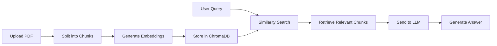

# 📄 AI PDF Assistant (RAG Chatbot)

<p align="center">
  
  
  
  
  
</p>

<p align="center">
  <b>Chat with your PDFs like ChatGPT using Retrieval-Augmented Generation (RAG)</b>
</p>

---


## 📌 Overview

AI PDF Assistant is a GenAI-powered document chatbot that allows users to upload PDFs and interact with them conversationally. It uses Retrieval-Augmented Generation (RAG) to generate accurate, context-aware answers by combining semantic search with large language models.

---

## ✨ Features

- Upload and process PDF documents  
- Chat-based interaction  
- Context-aware answers using RAG  
- Semantic search with embeddings  
- Source tracking for answers  
- Fast retrieval using ChromaDB  
- Modern UI with custom styling  
- Session-based chat history  
- Clear chat and reset database  

---

## 🧠 Architecture



---

## 🏗️ Tech Stack

Frontend:
- Streamlit  

Backend:
- Python  

AI / ML:
- OpenAI (GPT-4o-mini)  
- OpenAI Embeddings  

Frameworks & Libraries:
- LangChain  
- PyPDFLoader  
- RecursiveCharacterTextSplitter  

Database:
- ChromaDB  

Tools:
- dotenv  

---

## ⚙️ Installation

```bash
git clone https://github.com/your-username/ai-pdf-assistant.git
cd ai-pdf-assistant
pip install -r requirements.txt
```

Create `.env` file:

```
OPENAI_API_KEY=your_api_key
```

Run the app:

```bash
streamlit run app.py
```

---

## 📂 Project Structure

```
ai-pdf-assistant/
│── app.py
│── requirements.txt
│── .env
│── db/
```

---

## 📊 Use Cases

- Study assistant  
- Resume analysis  
- Business document insights  
- Research paper Q&A  
- Knowledge base chatbot  

---

## 🚀 Future Improvements

- Web search integration  
- Multi-PDF support  
- Long-term memory  
- Voice interaction  
- Export chat as PDF  

---


## 👨‍💻 Author

Rayees Ali  
B.Tech CSE | AI & Full Stack Enthusiast
