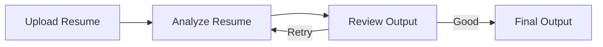

# 🤖 AI Resume Analyzer (LangGraph + LLM)

<p align="center">
  
  
  
  
  
</p>

<p align="center">
  <b>Smart AI-powered Resume Analyzer with Iterative Feedback System</b>
</p>

---


## 📌 Overview

AI Resume Analyzer is an intelligent system that evaluates resumes and provides actionable improvement suggestions using **LLMs and LangGraph**.  

It follows an **iterative feedback loop**, ensuring the generated suggestions meet quality standards before presenting them to the user.

---

## ✨ Features

- 📂 Upload resumes (PDF, DOCX, TXT)  
- 🤖 AI-powered resume analysis  
- 🔁 Iterative feedback refinement (up to 3 attempts)  
- 📊 Structured improvement suggestions  
- 🧠 Smart evaluation of response quality  
- 🎨 Modern glassmorphism UI  
- ⚡ Fast and responsive analysis  

---

## 🧠 Architecture



---

## 🏗️ Tech Stack

Frontend:
- Streamlit  

Backend:
- Python  

AI / ML:
- OpenAI (GPT-4o-mini)  

Frameworks & Libraries:
- LangGraph  
- PyPDF  
- python-docx  

Core Concepts:
- LLM-based Analysis  
- Iterative Feedback Loop  
- Quality Control System  

---

## ⚙️ Installation

```bash
git clone https://github.com/your-username/ai-resume-analyzer.git
cd ai-resume-analyzer
pip install -r requirements.txt
```

Create `.env` file:

```
OPENAI_API_KEY=your_api_key
```

Run the app:

```bash
streamlit run app.py
```

---

## 📂 Project Structure

```
ai-resume-analyzer/
│── app.py
│── requirements.txt
│── .env
```

---

## 📊 Use Cases

- Resume improvement for students  
- Placement preparation  
- ATS optimization guidance  
- Career coaching assistance  

---

## 🚀 Future Improvements

- Resume scoring (0–100)  
- ATS keyword matching  
- Downloadable feedback report (PDF)  
- Multi-resume comparison  
- Industry-specific suggestions  

---

## 🏆 Key Highlights

- Built an **iterative AI feedback system**  
- Implemented **LangGraph workflow**  
- Developed **LLM-based resume evaluation**  
- Designed **modern and interactive UI**  
- Ensured **quality-controlled outputs**  

---

## 👨‍💻 Author

Rayees Ali  
B.Tech CSE | AI & Full Stack Enthusiast
