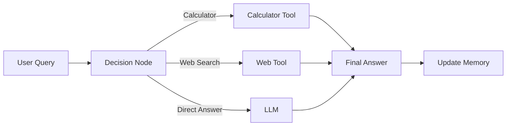

# 🧠 BrainSwitch AI (Multi-Tool AI Agent)

<p align="center">
  
  
  
  
  
</p>

<p align="center">
  <b>Smart AI Agent with Memory, Web Search, and Tool Calling</b>
</p>


---

## 📌 Overview

BrainSwitch AI is a multi-functional AI agent that dynamically decides how to respond to user queries. It integrates **tool calling, memory, and decision-making** to provide intelligent and context-aware responses.

The system can perform calculations, fetch real-time web data, and remember important information from conversations, making it a powerful **AI assistant system**.

---

## ✨ Features

- 💬 Chat-based AI interaction  
- 🧠 Long-term memory storage  
- 🌐 Real-time web search integration  
- 🧮 Built-in calculator tool  
- 🔀 Intelligent decision-making (Agent routing)  
- 📊 Context-aware responses using memory  
- ⚡ Fast and dynamic responses  
- 🧹 Clear chat and memory controls  

---

## 🧠 Architecture



---

## 🏗️ Tech Stack

Frontend:
- Streamlit  

Backend:
- Python  

AI / ML:
- OpenAI (GPT-4o)  

Frameworks & Libraries:
- LangGraph  
- LangChain  
- DuckDuckGoSearchRun  

Core Concepts:
- AI Agents  
- Tool Calling  
- Memory Systems  
- Decision Routing  

---

## ⚙️ Installation

```bash
git clone https://github.com/your-username/brainswitch-ai.git
cd brainswitch-ai
pip install -r requirements.txt
```

Create `.env` file:

```
OPENAI_API_KEY=your_api_key
```

Run the app:

```bash
streamlit run app.py
```

---

## 📂 Project Structure

```
brainswitch-ai/
│── app.py
│── requirements.txt
│── .env
```

---

## 📊 Use Cases

- Personal AI assistant  
- Real-time information retrieval  
- Smart calculator assistant  
- Conversational AI with memory  
- Multi-tool AI agent systems  

---

## 🚀 Future Improvements

- Voice interaction  
- Multi-agent collaboration  
- Persistent database memory  
- Advanced reasoning visualization  
- API integrations  

---

## 🏆 Key Highlights

- Built a **multi-tool AI agent system**  
- Implemented **decision-based routing (LangGraph)**  
- Integrated **web search + calculator tools**  
- Developed **long-term conversational memory**  
- Created a **real-world AI assistant**  

---


## 👨‍💻 Author

Rayees Ali  
B.Tech CSE | AI & Full Stack Enthusiast
